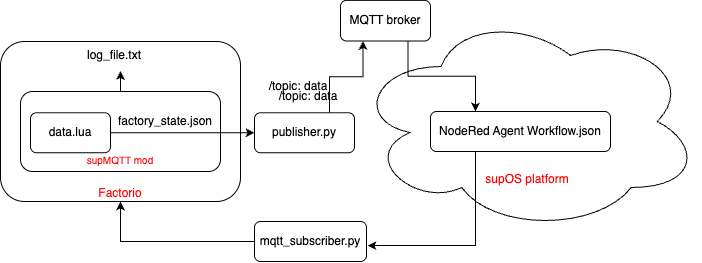

# Factorio MQTT Agent

A lightweight version of the [Factorio Agent](https://github.com/lvshrd/factorio-agent) project, specifically designed to work with supOS Node-RED flows. This mod package focuses on MQTT-based agent system for game state monitoring and control. It extends the original [Factorio MQTT Notify](https://github.com/intellicintegration/Factorio-MQTT-Notify) mod with enhanced features for industrial IoT (IIoT) applications. Check out the [Mod Documentation](docs/README.md) for more details.

<p align="center">
  
</p>

## Project Overview

This is a streamlined version of the original Factorio Agent project, modified to work as a Factorio mod that integrates with supOS Node-RED workflows. Instead of using the OpenAI Agent SDK directly, this version:

- Publishes game state data via MQTT
- Integrates with Node-RED for workflow automation
- Provides a simpler, more focused implementation for supOS integration

<p align="center">
  
</p>

## Technical Architecture

- **MQTT Protocol**: Communicates game state and commands
- **Node-RED Integration**: Provides workflow automation capabilities
- **Factorio Runtime API**: Implements game state monitoring via Lua Factorio API

<p align="center">
  
</p>

## Installation Guide

### Prerequisites

- [Factorio](https://www.factorio.com/) 2.0 or above
- Local Node-RED flow instance or example flow in [supOS](https://supos-ce-instance1.supos.app:8443/home)

1. Install the mod:
   - Download the supOS-agent mod from the [mod portal](https://mods.factorio.com/mod/supOS-agent)
   - Go to Factorio mods [directory](https://wiki.factorio.com/Application_directory) and unzip the mod

2. Configure the mod:
   - Edit `config.toml` in the mod directory (You may need to change the path of the script output)
   - **[Unnecessary]** Set your MQTT broker if u need (default supos-instance1)

3. Import the Node-RED workflow:
   - Open your supOS webpage and get the flow in example
   - **[Unnecessary]** or Import the workflow from `docs/NodeRed Agent Flow.json` to your own NodeRed service
   - Fill in the API key in Gemini node or DeepSeek node

4. Configure the Factorio server:
   - Configure the RCON port and password in `./config/config.ini` in your game directory

## Usage

1. Create a new single freeplay game with the mod enabled (When needed, start a Multiplayer game)
2. The mod will automatically begin collecting game state data
3. Start bash script `start_mac_supOS.sh` or `start_windows_supOS.bat` to enable the agent system (setup python environment and start the subscriber.py and publisher.py)

## Project Structure
```
supOS-agent/
├── docs/
│   └── NodeRed Agent Flow.json
├── scripts/
│   ├── excelGen.py   # Generate excel file containing topics structure from factorio game state
│   ├── publisher.py
│   ├── subscriber.py
│   ├── api/
│   │   ├── prototype.py
│   │   ├── factorio_interface.py
│   │   ├── sandbox/
│   │   │   └── base.py          
└── control.lua
```