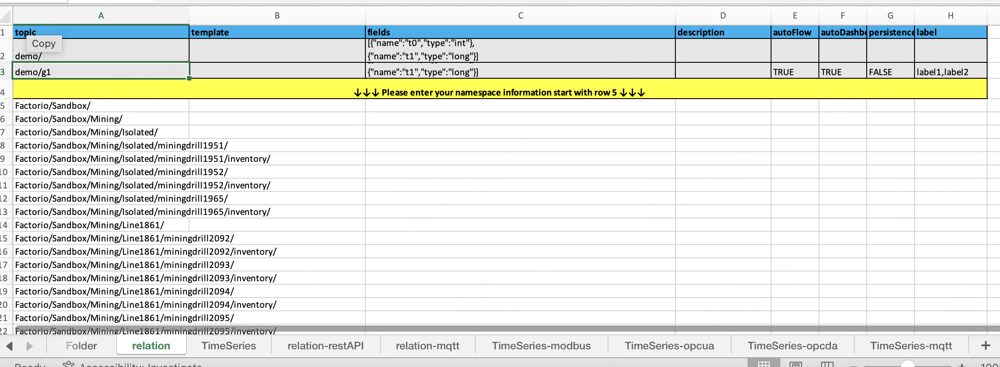

# Factorio Mod with MQTT Notify (Modified Version)

This project extends the original [Factorio MQTT Notify](https://github.com/intellicintegration/Factorio-MQTT-Notify) mod with enhanced features for industrial IoT (IIoT) applications. It includes:

1.  **Enhanced Factorio 2.0 mod** (in `control.lua` & `info.json`) that periodically generates a JSON snapshot (`factory_state.json`) with:
    * Machine status
    * Inventories
    * Pollution
    * Fluid info
    * Production counts
    * **Line ID assignment based on substation proximity**
    * **Tracking of electric poles**
    * **Generation of a global entity type table (`all_entity_types.json`) for testing**

2.  **Python script for MQTT** (`publisher.py`) that monitors `factory_state.json` and publishes updates to an MQTT broker with structured JSON messages, including:
    * **Line ID in MQTT topics**
    * **Logging of published topics and payloads to `LOG_FILE.txt`**
    * **Modified MQTT topic structure**

    ```txt
    example: Sandbox/PowerGeneration/Line-76/generator-1560/electric/current_energy
    ```
3.  **Python script for EXCEL Generation** (`excelGen.py`) which is used to generate `output-$timestamp$.xlsx` for data model import in [supOS](https://supos-proveit.supos.app) IIoT platform
    

## Installation & Usage

### Mod Installation

1.  Copy all as `sup-MQTT` folder (with `control.lua` & `info.json` inside) into your Factorio `mods` directory.
2.  Ensure your Factorio version is **2.0** or compatible with no direct `write_file` restrictions.

### Python Script

1.  Install Python 3.
2.  From this folder, create a virtual environment (optional) and install dependencies:

    ```bash
    python -m venv .venv
    source .venv/bin/activate  # or .\.venv\Scripts\activate on Windows
    pip install paho-mqtt==2.1.0
    ```
3. Create `config.py` in this directory and address following variables:
    ```python
    FACTORY_STATE_FILE = "/path/to/factory_state.json"                
    BROKER = "mqtt://broker_ip"                                       
    PORT = 1883                                                       
    TOPIC_PREFIX = "Factorio/demo"                               
    ADMIN = "mqtt_username"                                                   
    PASSWORD  = "mqtt_password"                                       
    LOG_FILE = "/path/to/log_file.txt"  
    ```
4.  Run `publisher.py`:

    ```bash
    python publisher.py
    ```

## Mod Behavior (Enhanced)

* When Factorio starts or loads, the mod scans for existing tracked entities (assembling machines, furnaces, mining drills, containers, **electric poles**, etc.).
* It identifies substations and assigns a `line_id` to entities within their production areas based on proximity.
* Every 1 second (60 ticks), it updates:
    * Production progress
    * Inventories
    * Status (bitmask integer)
    * Pollution, fluids
    * **Line ID assignment**
* Generates both `factory_state.json` and `all_entity_types.json` under `script-output/` .

The `factory_state.json` file has a structure like:

```json
{
    "tick": 123456,
    "assets": [
        {
            "unit_number": 14,
            "name": "assembling-machine",
            "type": "assembling-machine",
            "last_status": 53,
            "line_id": 142
        }
    ]
}
```
**18th Mar-Update**: For demo purpose, function `clear_final_product` added to check the steel chest in the target area(car production area here) and clear them when they get full. Besides, some bugs fixed.
